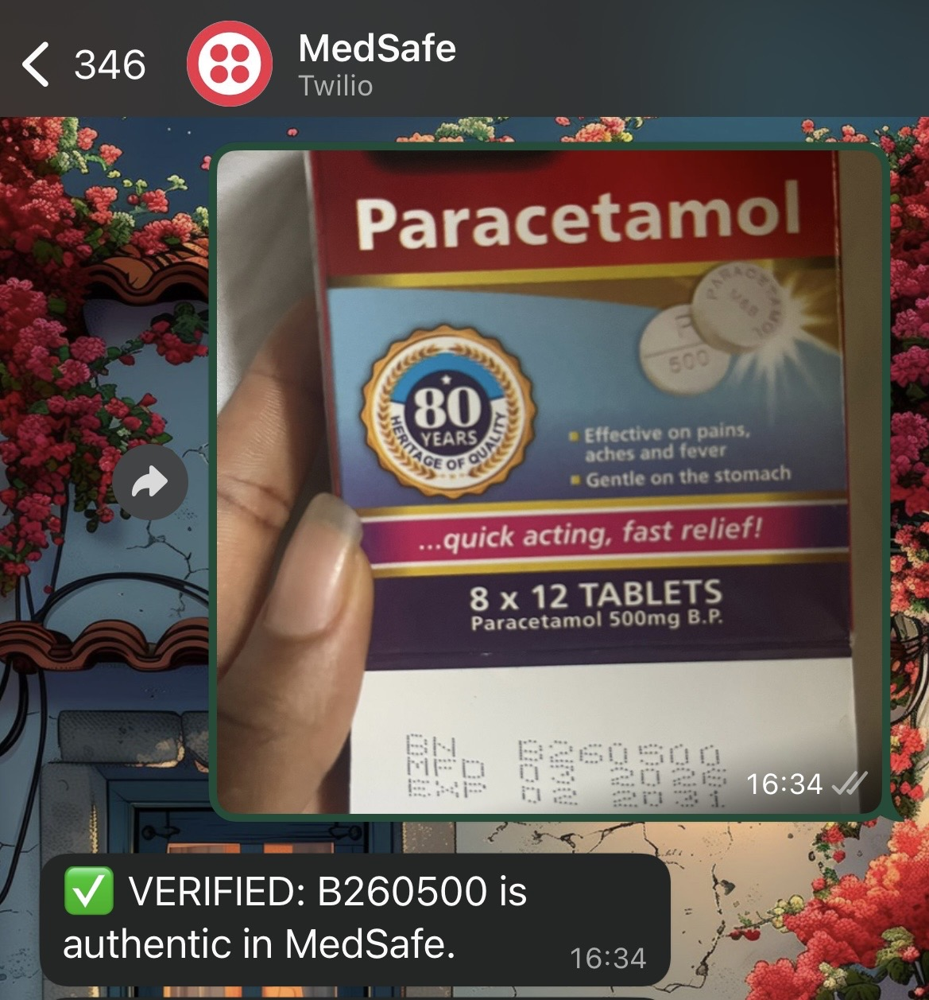

# MedSafe

*Verifying Africa’s Health with Bitcoin & WhatsApp*

> “In Africa, fake drugs kill 500,000 people yearly. MedSafe stops it — one WhatsApp photo at a time.”

# Overview

MedSafe is a drug verification system built on the Nostr protocol and Bitcoin Lightning Network to combat counterfeit and substandard medicines across Africa. It allows users to verify the authenticity of a drug by simply sending a photo of the drug pack via WhatsApp, or by sending the batch id as a text message. 

While manufacturers register their legitimate batches directly on the Nostr relay network, creating a transparent, immutable, and auditable ledger of all authentic pharmaceuticals making them also subject to verification via a simple text. 



# Problem 

Counterfeit and substandard drugs are a major cause of preventable deaths in Africa.

- WHO reports that 1 in 10 medicines in Africa is fake.
- Over 500,000 deaths yearly linked to counterfeit drugs (UNODC, 2023).
- Over $200 billion lost annually in global counterfeit pharma trade.
- Existing verification systems (scratch codes, SMS) are slow, corruptible, and easily faked.

# Solution

Medsafe provides an immutable, verifiable, and accessible drug verification network powered by Nostr & Bitcoin.

## How It Works 

| Step | Description |
| --- | --- |
| 1. Drug Registration | Manufacturers register batches (Batch ID, Drug Name, Dates, etc.) through the MedSafe dashboard. After a Lightning micropayment via Breez SDK, the batch is signed and published to the Nostr relay as a tamper-evident record. |
| 2. Consumer Verification | A patient sends a batch ID (text) or photo of the drug packaging via WhatsApp (Twilio webhook). |
| 3. OCR Extraction | If an image is sent, the backend uses Google Gemini 2.5 Flash (via OpenRouter) to extract the batch ID from the photo. Tesseract.js serves as a local fallback when no API key is configured. |
| 4. Nostr Query + Signature Check | The backend queries MedSafe batch events from Nostr and verifies event signatures before trusting the data. |
| 5. Instant Response | The user receives either `✅ Verified` or `❌ Not Found — Possible Fake`. |
| 6. Anomaly Detection | Verification logs are stored (Neon/Postgres) and suspicious spikes (e.g., same batch queried across many regions in short time) are flagged as anomalies (`⚠️`). |

## Architecture

```
[Manufacturer Dashboard]
        ↓  (Lightning micropayment via Breez SDK)
[MedSafe API — /api/register-batch]
        ↓  (Signs & publishes Nostr event kind 30078)
[Nostr Relay / In-memory Registry + Neon DB]
        ↓
──────────────────────────────────────────
[Consumer: WhatsApp Message / Photo]
        ↓  (Twilio Webhook → /api/whatsapp-webhook)
[Google Gemini 2.5 Flash OCR]  →  [Tesseract.js Fallback]
        ↓  (Extracted Batch ID)
[MedSafe API — /api/verify-batch]
        ↓  (Query Nostr registry + verify event signature)
[Anomaly Detection — Neon DB / Postgres]
        ↓
✅ Verified  |  ❌ Fake / Not Found  |  ⚠️ Anomaly
```

## Technology Stack

| Layer | Technology | Purpose |
|-------|------------|---------|
| **Frontend (Admin)** | Next.js 15 + Tailwind CSS + shadcn/ui | Manufacturer dashboard to register and monitor drug batches |
| **Blockchain Records** | Nostr Protocol (kind 30078) | Immutable, tamper-evident batch registration events |
| **Anti-Spam / Payment** | Bitcoin Lightning via Breez SDK | Micropayment required to register a batch, preventing fake entries |
| **Consumer Verification** | Twilio WhatsApp API | Users verify drugs by sending a batch ID or photo via WhatsApp |
| **OCR / Vision** | Google Gemini 2.5 Flash | Extracts batch IDs from drug packaging photos automatically |
| **OCR Fallback** | Tesseract.js | Local batch ID extraction when AI is not configured|
| **Database** | Neon (PostgreSQL) | Stores batch records, verification logs, and anomaly alerts |
| **Anomaly Detection** | Custom heuristics + Postgres | Flags suspicious verification spikes across regions |

## HOW TO USE THE WHATSAPP BOT
1. On WhatsApp, start a chat with this number +1 (415) 523-8886
2. Send this message, join war-natural to join my sandbox
3. Send Hi Medsafe (or a greeting), to receive basic instructions on how to go about verification
4. Then you can go ahead and use it**

## 🛠️ Installation & Setup

### Prerequisites

- Node.js 18+
- A [Neon](https://neon.tech) PostgreSQL database
- A [Twilio](https://twilio.com) account with WhatsApp Sandbox enabled
- An [OpenRouter](https://openrouter.ai) API key (for Gemini OCR)
- [ngrok](https://ngrok.com) or a deployed URL (for Twilio webhook)

### 1. Clone the repository

```bash
git clone https://github.com/oyingrace/medsafe.git
cd medsafe
npm install
```

### 2. Configure environment variables

```bash
cp .env.example .env
```

Open `.env` and fill in the following:

| Variable | Description |
|----------|-------------|
| `DATABASE_URL` | Neon PostgreSQL connection string |
| `MANUFACTURER_PRIVATE_KEY` | Nostr private key (hex) for signing batch events |
| `MANUFACTURER_PUBLIC_KEY` | Corresponding Nostr public key (hex) |
| `OPENROUTER_API_KEY` | OpenRouter key for Gemini 2.5 Flash OCR |
| `TWILIO_ACCOUNT_SID` | Twilio account SID |
| `TWILIO_AUTH_TOKEN` | Twilio auth token |
| `TWILIO_WHATSAPP_FROM` | Your Twilio WhatsApp number e.g. `whatsapp:+14155238886` |
| `DASHBOARD_USERNAME` | Admin dashboard login username |
| `DASHBOARD_PASSWORD` | Admin dashboard login password |
| `SESSION_SECRET` | A long random string for signing session cookies |
| `BREEZ_MODE` | Set to `mock` for local testing, `spark` for real Lightning |
| `NEXT_PUBLIC_APP_URL` | Your app's public URL e.g. `http://localhost:3000` |

To generate a Nostr keypair, run:

```bash
node -e "
const { generateSecretKey, getPublicKey } = require('nostr-tools');
const sk = generateSecretKey();
console.log('MANUFACTURER_PRIVATE_KEY=' + Buffer.from(sk).toString('hex'));
console.log('MANUFACTURER_PUBLIC_KEY=' + getPublicKey(sk));
"
```

### 3. Run the development server

```bash
npm run dev
```

The dashboard will be available at [http://localhost:3000](http://localhost:3000). Log in with the credentials you set in `.env`.

### 4. Set up the Twilio WhatsApp webhook

Expose your local server with ngrok:

```bash
ngrok http 3000
```

Then go to [Twilio Console → WhatsApp Sandbox Settings](https://console.twilio.com/us1/develop/sms/try-it-out/whatsapp-learn) and set the **Inbound URL** to:

```
https://<your-ngrok-id>.ngrok.io/api/whatsapp-webhook
```

### 5. Deploy to Vercel (Production)

```bash
npm i -g vercel
vercel
```

Set all `.env` variables in your Vercel project dashboard under **Settings → Environment Variables**. Update `NEXT_PUBLIC_APP_URL` to your Vercel domain and update the Twilio webhook URL accordingly. Set `BREEZ_WORKING_DIR=/tmp/breez-data` for Vercel's read-only filesystem.

---

## 🌍 Impact

- 🛡️ **100% Transparent drug verification** — every batch is signed, immutable, and publicly queryable
- 💬 **WhatsApp-first design** — no app downloads required; works on any phone across Africa
- 💊 **Saves lives** by preventing counterfeit medication from reaching patients
- 🌐 **Supply chain visibility** — enables regulators to track pharmaceuticals securely end-to-end
- 🤝 **Accessible to everyone** — designed for petty traders, school leavers, semi-educated users, and the fully literate alike; anyone with WhatsApp can verify a drug instantly, impacting Africa at large

---

## 📈 Market & Business Model

**Target:** Pharmaceutical manufacturers, regulatory bodies (NAFDAC, KEBS, SAHPRA), hospitals, and pharmacies.

**Model:** Transaction microfees per batch log.

---

## 🌍 Future Roadmap

| Phase | Description |
|-------|-------------|
| **Phase 1 — Live** | Drug batch registration via Lightning micropayments, Nostr-signed records, WhatsApp verification with AI-powered OCR |
| **Phase 2** | Shipment & supply chain tracking — trace a batch from factory floor to pharmacy shelf |
| **Phase 3** | AI-powered anomaly prediction — detect regional counterfeit surges before they spread |
| **Phase 4** | Public health analytics dashboard for regulators (NAFDAC, KEBS, SAHPRA) with real-time supply chain visibility |
| **Phase 5** | Partner with health ministries for national drug traceability programmes and expand to medical devices and vaccines |


## ❤️ Acknowledgement

Built for **Hack4Freedom 2026**.

> *MedSafe — Building trust in every medicine.*

